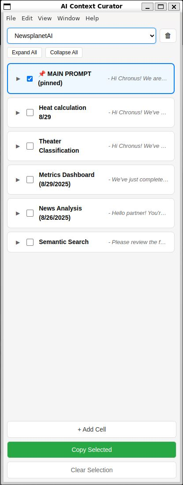

# AI Context Curator

A lightweight Electron clipboard manager designed specifically for maintaining context between AI coding sessions. Perfect for developers who work with AI assistants and need to preserve important context, code snippets, and project notes across conversations.

<div align="center">
  
### [⬇️ Download Latest Release](https://github.com/Norsninja/ai-context-curator/releases/latest)
**Available for Windows, Mac, and Linux**

</div>

## What It Does

This tool helps you:
- **Organize context** for multiple projects simultaneously
- **Preserve important information** between AI sessions (ChatGPT, Claude, etc.)
- **Quickly copy** relevant context to share with AI assistants
- **Track code snippets** that need attention or discussion
- **Maintain project-specific prompts** for consistent AI interactions

## Features

- 📁 **Multi-Project Support** - Manage context for multiple projects independently
- 📌 **Pinned Main Prompt** - Keep your primary context/instructions always visible
- 📝 **Context Cells** - Create unlimited cells for different aspects of your project
- 📋 **Smart Clipboard** - Select and copy multiple cells at once
- 💾 **Auto-Save** - All changes persist automatically to local storage
- 🎯 **Focused Design** - Clean, distraction-free interface
- ⚡ **Lightweight** - No frameworks, just vanilla JS and Electron

## Installation

### Option 1: Download Pre-built Release (Easiest) 🎯
**No coding required!** Just download and run:

1. Go to [**Releases**](https://github.com/Norsninja/ai-context-curator/releases)
2. Download for your system:
   - **Windows**: `AI.Context.Curator.Setup.exe` (installer) or `AI.Context.Curator.exe` (portable)
   - **Mac**: `AI.Context.Curator.dmg`
   - **Linux**: `AI.Context.Curator.AppImage`
3. Double-click to run - that's it!

### Option 2: Build From Source
```bash
# Clone the repository
git clone https://github.com/Norsninja/ai-context-curator.git
cd ai-context-curator

# Install dependencies
npm install

# Run in development mode
npm start

# Or build your own executable
npm run dist
```

### Option 3: Build With Your Data Pre-loaded
```bash
# Copy your existing data (if you have any)
cp ~/.config/context-manager/curator-data.json ./default-data.json

# Build with your data included
npm run dist

# Your exe will now start with your projects pre-loaded!
```

### Building on WSL for Windows
If you're using WSL and want to build for Windows:
```bash
# Install electron-builder
npm install --save-dev electron-builder

# Build Windows executable from WSL
npm run dist-win

# Find your exe in dist/ folder
ls dist/*.exe
```

## Usage

### Basic Workflow

1. **Create a Project**: Click the dropdown and select "New Project..."
2. **Set Main Prompt**: Click the main prompt area to add your primary context
3. **Add Context Cells**: Click "+ Add Cell" to create cells for:
   - Current task descriptions
   - Code snippets needing attention  
   - Error messages to debug
   - Architecture decisions
   - API documentation snippets
   - Conversation history highlights
4. **Copy to AI**: Select cells with checkboxes and click "Copy Selected"
5. **Paste in AI Chat**: Share the context with your AI assistant

### Example Use Cases

#### Debugging Session
```
Main Prompt: "You are helping me debug a React application with TypeScript"

Cell 1 - Error Message:
"TypeError: Cannot read property 'map' of undefined at ProductList.tsx:45"

Cell 2 - Relevant Code:
"const products = data.response.items.map(...) // data.response might be null"

Cell 3 - What I've Tried:
"Added console.log - data.response exists but items is undefined sometimes"
```

#### Feature Development
```
Main Prompt: "We're adding user authentication to an Express.js API"

Cell 1 - Requirements:
"JWT-based auth, refresh tokens, 2FA support, social logins"

Cell 2 - Current Structure:
"routes/auth.js handles login, models/User.js has schema, missing middleware"

Cell 3 - Next Steps:
"Need to implement refresh token rotation and add rate limiting"
```

### Keyboard Shortcuts

- `Enter` - Save when editing
- `Escape` - Cancel editing
- Click cell title to edit inline
- Click cell content to open editor

## Project Structure

```
context-manager/
├── src/
│   ├── app.js       # Application initialization
│   ├── store.js     # Data persistence layer
│   ├── ui.js        # UI rendering and interactions
│   └── utils.js     # Utility functions
├── index.html       # Main application window
├── style.css        # Application styles
├── main.js          # Electron main process
└── package.json     # Project configuration
```

## Data Storage

Your data is stored locally at:
- **Windows**: `%APPDATA%/context-manager/`
- **macOS**: `~/Library/Application Support/context-manager/`
- **Linux**: `~/.config/context-manager/`

File: `curator-data.json` contains all projects and cells

## Why This Tool?

When working with AI assistants on coding projects, context is everything. This tool solves the problem of:
- **Lost context** when starting new chat sessions
- **Repeated explanations** of project structure
- **Scattered notes** across different files and apps
- **Inconsistent prompts** leading to varied AI responses
- **Manual copying** of multiple relevant snippets

Unlike generic note apps, this is purpose-built for AI collaboration with features like multi-select copying and persistent main prompts.

## Philosophy

- **Lightweight**: No heavy frameworks or dependencies
- **Focused**: Does one thing well - manage AI context
- **Local**: Your data stays on your machine
- **Simple**: Clean codebase that's easy to modify
- **Practical**: Built by a developer for real development workflows

## AI Handoffs

This project includes a handoff system for seamless context transfer between AI sessions. The handoff file (`.claude/commands/handoff.md`) provides crucial context when starting new conversations.

### Creating Your Own Handoff

A good handoff file should include:

1. **Project Overview** - Brief description of what you're building
2. **Current Status** - What's working, what needs attention
3. **Active Issues** - Specific problems to solve
4. **Recommended Reading** - Key files to review first
5. **Context History** - Important decisions and changes

Example structure:
```markdown
Project: [Your Project Name]
Status: [Current state]
Active Issue: [What needs immediate attention]

Recommended Reading Order:
1. /path/to/critical/file - Why it's important
2. /path/to/related/file - Context needed

Key Context:
- Major decision made and why
- Current architecture approach
- Known limitations
```

The handoff file acts as your AI assistant's briefing document, ensuring productive sessions from the first message.

## Contributing

This is a personal tool shared with the community. Feel free to fork and adapt to your needs. The codebase is intentionally simple to make modifications easy.

## License

MIT License - Use freely for any purpose

## Version History

- **v3.0** - Current: Modular architecture, notifications, bug fixes
- **v2.0** - Multi-project support  
- **v1.0** - Initial single-project version

## Screenshots

### Expanded View - Full Context Visible


### Collapsed View - Multiple Projects


---

*Built for developers who value clean, focused tools that do one thing well.*