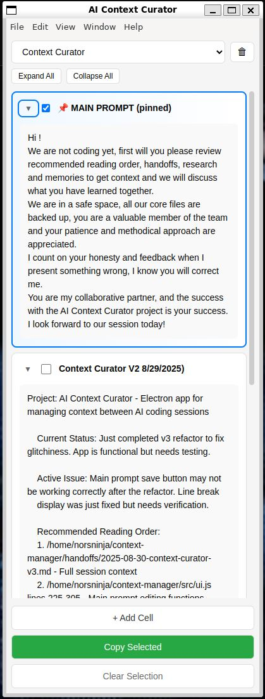

# AI Context Curator

> A custom clipboard manager for AI sessions + a methodology for maintaining context between conversations

**The App:** Context Curator is a specialized copy-paste tool that organizes your AI session materials - main prompts, handoffs, research notes - and lets you copy them in one click to start AI conversations with full context.

**The Method:** Part of a simple but effective methodology for AI collaboration using structured handoffs that ensure continuity between sessions.

<div align="center">
  
### [⬇️ Download Context Curator App](https://github.com/Norsninja/ai-context-curator/releases/latest)
**Windows • Mac • Linux**

</div>

## The Problem We're Solving

Every AI coding session starts with amnesia. Your AI assistant has no memory of:
- What you built yesterday
- Why you made certain decisions  
- What's currently broken
- Where you left off

This leads to:
- Repeated explanations
- Contradictory suggestions
- Wasted context window
- Lost momentum

## The Methodology: Structured Handoffs

After hundreds of AI pair programming sessions, I've developed a systematic approach that creates **true continuity** between sessions. It's not about building complex memory systems - it's about disciplined knowledge transfer.

### Core Principles

1. **Context Before Code** - Never start coding cold. Always review context together first.
2. **Research Before Implementation** - Understand the problem space before writing solutions.
3. **Handoffs Are Mandatory** - Every session ends with a structured handoff, no exceptions.
4. **New Ideas = New Sessions** - Never pivot after using 50%+ of context window.
5. **Document As You Go** - Update sprint.md and docs during work, not after.

### The Session Flow

```
Session Start:
├── Load context (main prompt + handoff)
├── AI reviews and acknowledges understanding
├── Discuss what was learned
├── Research if needed
├── Create plan
└── Begin implementation

Session End:
├── Complete current task (don't leave things half-done)
├── Generate handoff with `/handoff` command
├── Save handoff to project directory
└── Update Context Curator for next session
```

## Implementing The Methodology

### Option 1: Simple File-Based System (No Tools Required)

Create this structure in your project:
```
your-project/
├── project/
│   ├── handoffs/
│   │   ├── HANDOFF_20250830_FeatureComplete.md
│   │   └── HANDOFF_20250829_BugFixSession.md
│   └── templates/
│       └── HANDOFF_TEMPLATE.md
└── sprint.md         # Current tasks and priorities
```

**Workflow:**
1. Start each session by copying your main prompt + latest handoff
2. Paste into AI chat
3. Work through your sprint.md tasks
4. Before context window fills, create new handoff
5. Save to handoffs directory with date

**Handoff Template:** Copy from [project/templates/HANDOFF_TEMPLATE.md](project/templates/HANDOFF_TEMPLATE.md)

### Option 2: Context Curator App (Streamlined Workflow)

The Context Curator app streamlines this process:



**Features:**
- **Main Prompt Field** - Your standard greeting that never changes
- **Context Cells** - Organize handoffs, research notes, sprint status
- **Multi-Project Support** - Separate contexts for different projects
- **One-Click Copy** - Select relevant cells and copy to clipboard
- **Persistent Storage** - Never lose your carefully crafted context

**How It Replaces Text Files:**
- No more multiple notepad windows
- No more copy/paste gymnastics
- No more lost context between sessions
- Visual organization of your handoff materials

### Option 3: Full Integration with Claude Code

**Setup:**
1. Install Context Curator app
2. Create `/project/templates/HANDOFF_TEMPLATE.md` in your project
3. Add handoff command to Claude (see below)
4. Use `/handoff` command at session end

**Claude Code Handoff Command:**
Create `.claude/commands/handoff.md`:
```markdown
Please create a session handoff document using the template at 
project/templates/HANDOFF_TEMPLATE.md. Focus on: $ARGUMENTS

Save it to project/handoffs/ with today's date.
```

## Why This Works

### Context Window Economics
- Starting with full context uses ~5-10% of window
- But saves 30-40% by avoiding re-explanation
- Leave 20% buffer for handoff generation
- Never pivot after 50% - quality degrades

### The Power of Warm Starts
Cold start (no context):
```
You: "Help me fix the scoring bug"
AI: "What technology stack? What's the bug? Can you show me code?"
[Wastes 20+ messages establishing context]
```

Warm start (with handoff):
```
You: [Paste context + handoff]
AI: "I see the scoring issue from yesterday's session. The problem is in 
     calculateScore() where the multiplier isn't applied. Let me continue 
     where we left off..."
[Immediately productive]
```

### Sprint.md as Source of Truth
Example sprint.md:
```markdown
# Current Sprint: Event System Refactor

## In Progress
- [ ] Fix scoring calculation bug (see handoff 20250829)
- [ ] Refactor event listener architecture

## Blocked
- [ ] Payment integration - waiting for API keys

## Completed
- [x] Database migration to PostgreSQL
- [x] Setup theater classification pipeline
```

## Real-World Example

Here's an actual handoff from my project:

```markdown
# Session Handoff: V3 Refactor Complete

**Created**: 2025-08-30 09:45 AM
**Context Window**: 65% - Approaching limit
**Focus**: Bug fixes and GitHub Actions setup

## 🎯 Critical Context
Successfully completed v3 refactor with modular architecture. All UI bugs fixed,
GitHub Actions now automatically building releases for all platforms.

## ✅ What Was Accomplished
- Fixed save button persistence issue (ui.js:500-510)  
- Resolved false error notifications on project creation
- Implemented GitHub Actions CI/CD with automated releases
- Updated build configuration for cross-platform support

## 🚧 Current Working State
- ✅ All critical bugs fixed
- ✅ Automated builds working
- ⏳ Optional: Dark mode (not started)

## 🚨 Next Immediate Steps
1. Monitor GitHub Actions for any build failures
2. Consider implementing export/import JSON feature
3. User requested drag-drop reordering for cells

## 📁 Files Modified
- `src/ui.js` - Fixed save button and notification bugs
- `.github/workflows/build-release.yml` - Complete CI/CD setup
- `README.md` - Simplified to reflect actual purpose
```

## Getting Started

### Quick Start (Just Try It)
1. Download [Context Curator](https://github.com/Norsninja/ai-context-curator/releases/latest)
2. Copy the [handoff template](project/templates/HANDOFF_TEMPLATE.md)
3. Start your next AI session with structure

### Full Adoption
1. Create project structure (handoffs/, templates/, sprint.md)
2. Define your main prompt with collaboration guidelines (store in Context Curator)
3. Install Context Curator for managing multiple projects
4. Configure Claude Code with /handoff command
5. Commit handoffs to git for team sharing

## Installation

### Context Curator App

**Download:** Get the latest from [Releases](https://github.com/Norsninja/ai-context-curator/releases)

**Build from source:**
```bash
git clone https://github.com/Norsninja/ai-context-curator.git
cd ai-context-curator
npm install
npm start
```

**Data Location:**
- **Windows**: `%APPDATA%/AI Context Curator/`
- **Mac**: `~/Library/Application Support/AI Context Curator/`
- **Linux**: `~/.config/AI Context Curator/`

## FAQ

**Q: Why not use a vector database or RAG system?**
A: Structured handoffs beat unstructured memories. The overhead of maintaining a "smart" system usually exceeds the benefits. Simple files + good process > complex systems.

**Q: Can I use this with ChatGPT/Gemini/other AIs?**
A: Yes! The methodology is AI-agnostic. The `/handoff` command is Claude-specific but you can manually create handoffs for any AI.

**Q: How do you handle very long projects?**
A: Old handoffs become research documents. Recent handoffs (last 3-5 sessions) stay in Context Curator. The sprint.md maintains overall project state.

**Q: What if I forget to make a handoff?**
A: The AI will remind you when context window approaches 80%. But make it a habit - it only takes 2 minutes and saves hours of confusion.

## Contributing

This methodology emerged from real-world AI collaboration pain. If you have improvements or adaptations, please share them. The tool is MIT licensed - fork and adapt freely.

## Philosophy

> "Memory without structure is just noise. The protocol matters more than the platform."

The best system is one you'll actually use. This methodology is deliberately simple because simplicity drives adoption. The Context Curator app is just one implementation - the principles work with any tools.

---

*Built for developers who collaborate with AI and value continuity over complexity.*